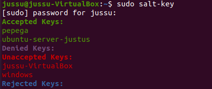
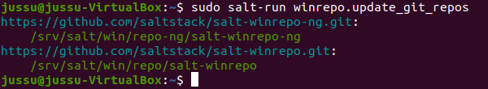
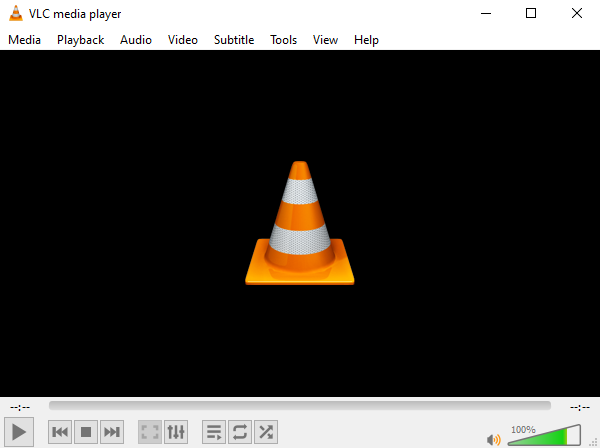
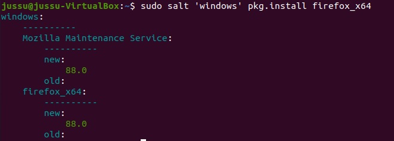
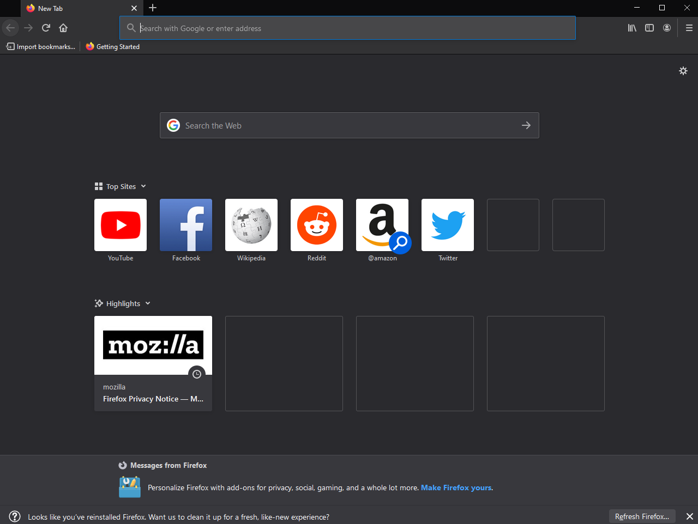

#Harjoitus 6

## a) Kokeile saltia windowsissa

Käytin windows minionin luomiseen apuna rikurikurikun [tehtäväraporttia](https://github.com/rikurikurikuriku/Palvelinten-hallinta/wiki/H5-Aikajana#b-windows-pakettivarasto-ja-vs)

Aloitin tehtävän tekemisen lataamalla salt minionin [salt stackin nettisivulta](https://repo.saltstack.com/#windows)
Installerissa laitetaan masterin IP-osoite ja nimi.

 

Kävin masterissa katsomassa, että onko sinne tullut yhtään hyväksymättömiä avaimia.

Hyväksyin juuri luodun windows avaimen. 

Päivitetään winrepo

Kokeilin asentaa rikurikurikun ohjeessa olevan vlc media playerin hänen käyttämällään komennolla sudo salt 'windows' pkg.install vlc

Asennus ja sovellus toimi moitteitta.

kokeilin vielä asentaa jotain uutta Joten päätin asentaa firefoxin windowsille. Löysin komennon firefoxin asennukselle rikurikurikun raportissa olevan [Linkin takaa.](https://docs.saltproject.io/en/latest/topics/windows/windows-package-manager.html)

  salt 'windows' pkg.install firefox_x64
  

## Lähteet

https://repo.saltstack.com/#windows

https://docs.saltproject.io/en/latest/topics/windows/windows-package-manager.html

https://github.com/rikurikurikuriku/Palvelinten-hallinta/wiki/H5-Aikajana#b-windows-pakettivarasto-ja-vs
